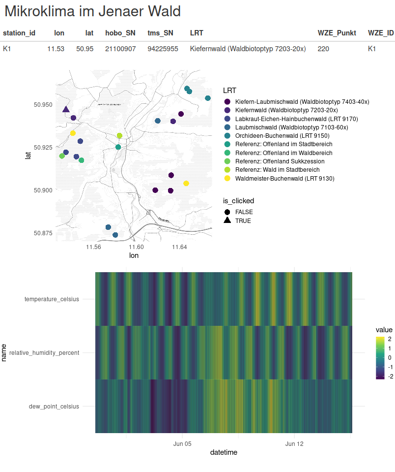

# Mikroklima im Jenaer Wald

Im Rahmen des Jena Hackathos Hack the paradise wurde eine Visualisierung geschrieben, die Temperatur und Bodenfeuchte des Jenaer Waldes anzeigt.

Die Daten koennen angefragt werden bei:

Markus Römermann
Olaf Schubert
Markus Ziermann

